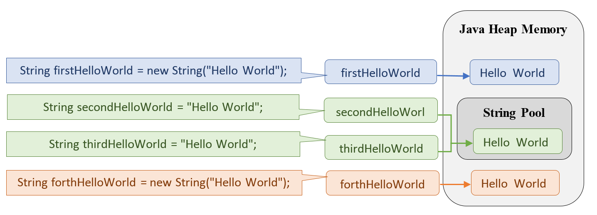

### Summary:

[recursion](https://www.google.com/search?q=recursion)\
[tail-call recursion](https://www.quora.com/What-is-the-difference-between-normal-recursion-and-tail-recursion-with-examples)

Arrays:
* java.util.Arrays.sort`
* java.util.Arrays.binarySearch

Collections:
* java.util.Collections.sort
* java.util.Collections.binarySearch

### Литература:

[Java. Справочник - Флэнаган Д.](http://gen.lib.rus.ec/book/index.php?md5=9A8F95A5F9DA2E98D34F3BE66BDB946E): 38-81

[Структуры данных и алгоритмы в Java. - Лафоре Р.](http://gen.lib.rus.ec/book/index.php?md5=A05BAA95E9A2E4754B2126B7F690D4A1): 87 - 120