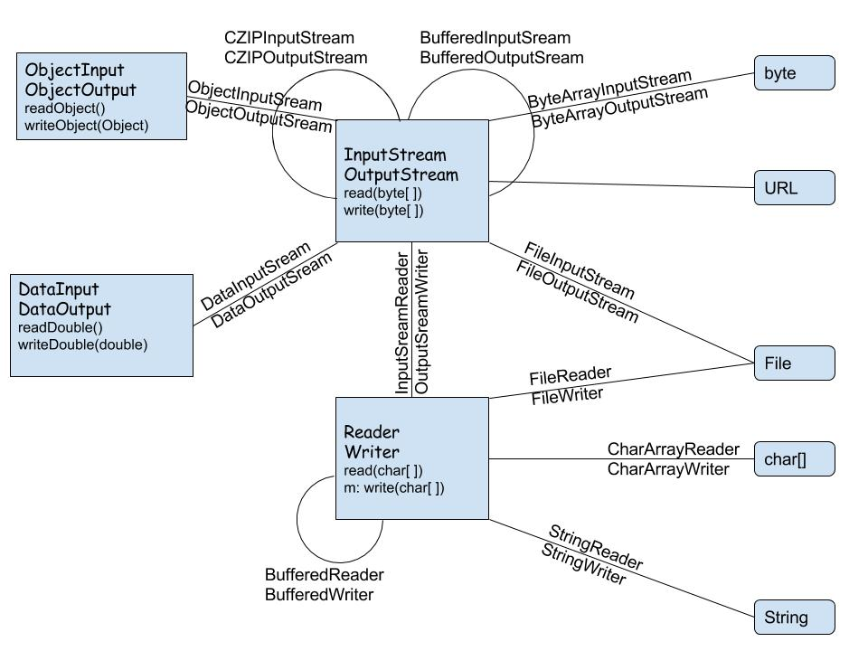

####Summary:

###Литература:

[Java SE 8. Базовый курс, Кей С. Хорстманн](http://gen.lib.rus.ec/book/index.php?md5=BE98713052E8B179E988A43DED02ABDF): 279 - 314

[Философия Java. Эккель Б.](http://gen.lib.rus.ec/book/index.php?md5=3C49E900CFC0228BCF75C2567747E793): 483 - 555

[Java. Справочник - Флэнаган Д.](http://gen.lib.rus.ec/book/index.php?md5=9A8F95A5F9DA2E98D34F3BE66BDB946E): 343 - 401