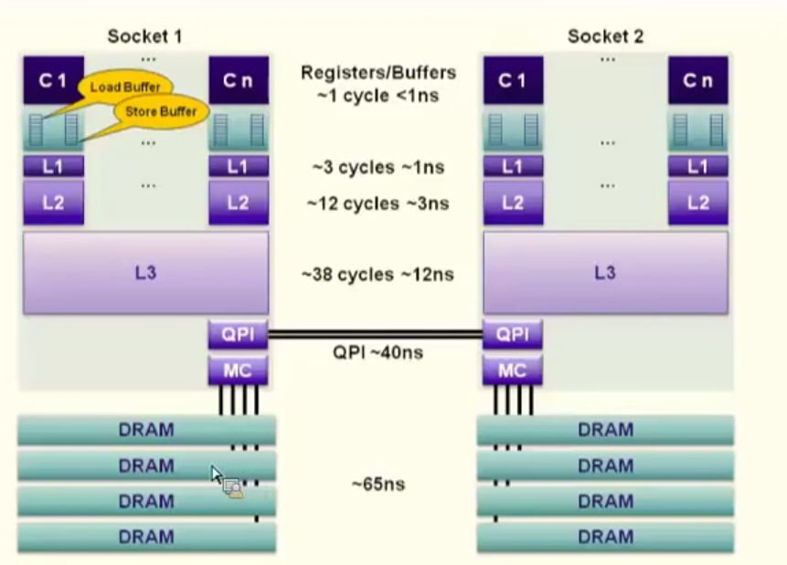
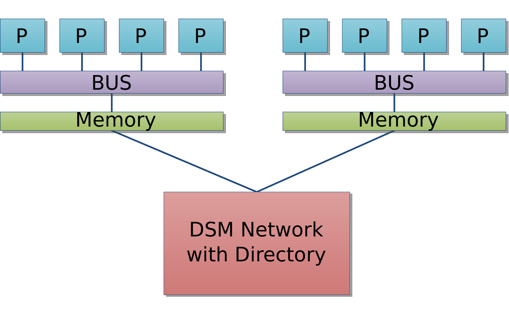
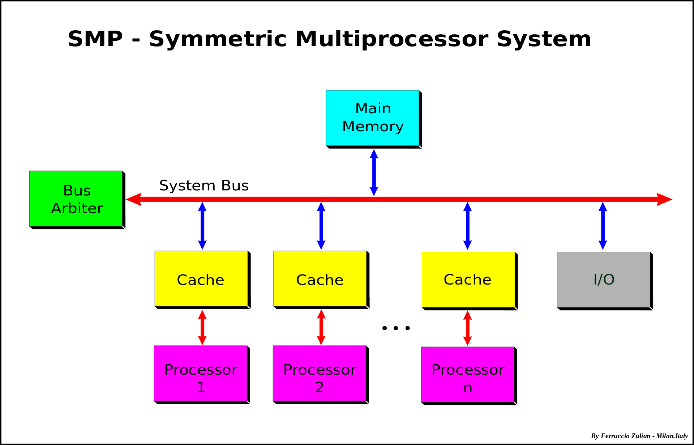

####Summary:

###Литература:
[NUMA](https://en.wikipedia.org/wiki/Non-uniform_memory_access)

[SMP](https://en.wikipedia.org/wiki/Symmetric_multiprocessing)

[cache coherence](https://en.wikipedia.org/wiki/Cache_coherence)

[false-sharing](https://mechanical-sympathy.blogspot.com/2011/07/false-sharing.html)

[JMM](https://docs.oracle.com/javase/specs/jls/se8/html/jls-17.html)

[juc](https://habr.com/company/luxoft/blog/157273/)

[synchronizers](https://habr.com/post/277669/)

[Java SE 8. Базовый курс, Кей С. Хорстманн](http://gen.lib.rus.ec/book/index.php?md5=BE98713052E8B179E988A43DED02ABDF): 315 - 353

[Философия Java. Эккель Б.](http://gen.lib.rus.ec/book/index.php?md5=3C49E900CFC0228BCF75C2567747E793): 358 -398