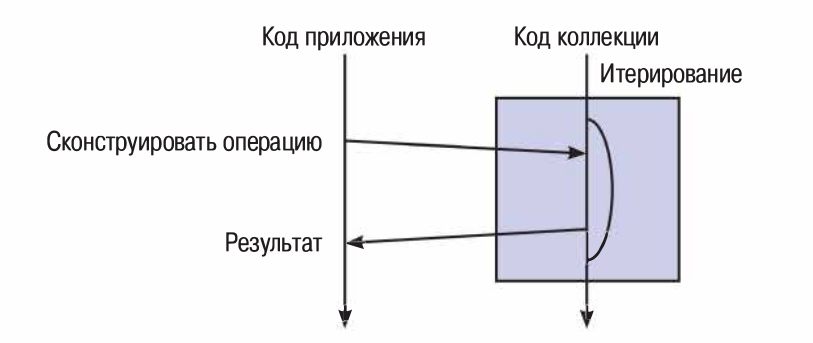

### Summary:

### Литература:

[Java SE 8. Базовый курс, Кей С. Хорстманн](http://gen.lib.rus.ec/book/index.php?md5=BE98713052E8B179E988A43DED02ABDF) 253 - 275

[Лямбда-выражения в Java 8](http://gen.lib.rus.ec/book/index.php?md5=A9EDA855A408A29A95B5ED9F214810BF): 16 - 113